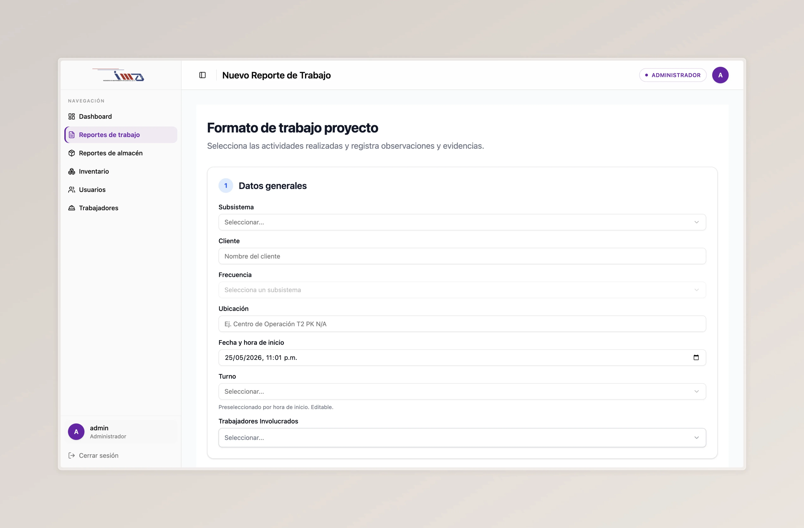
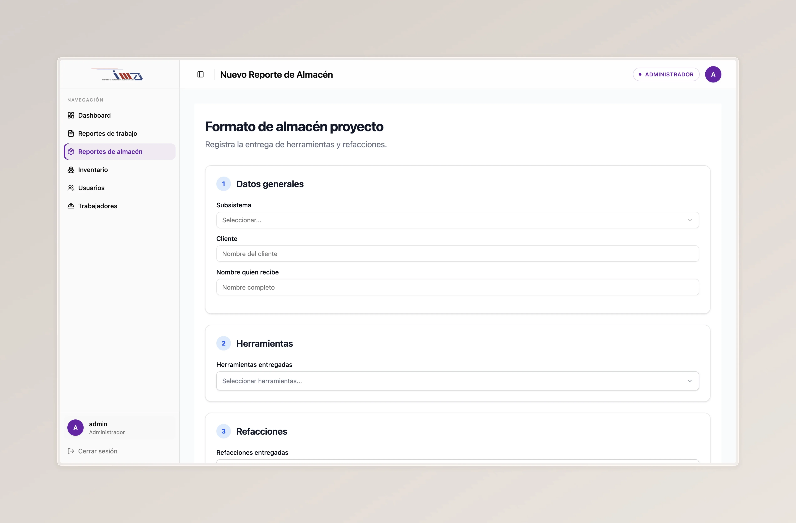
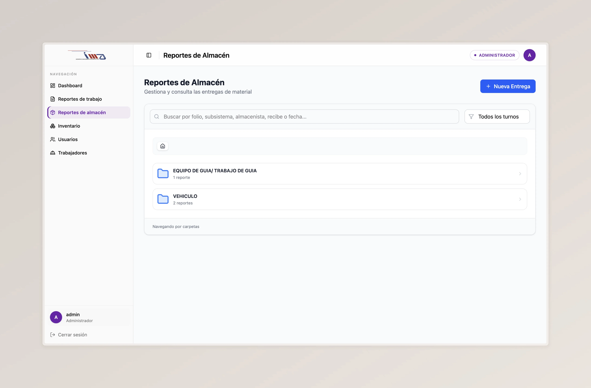
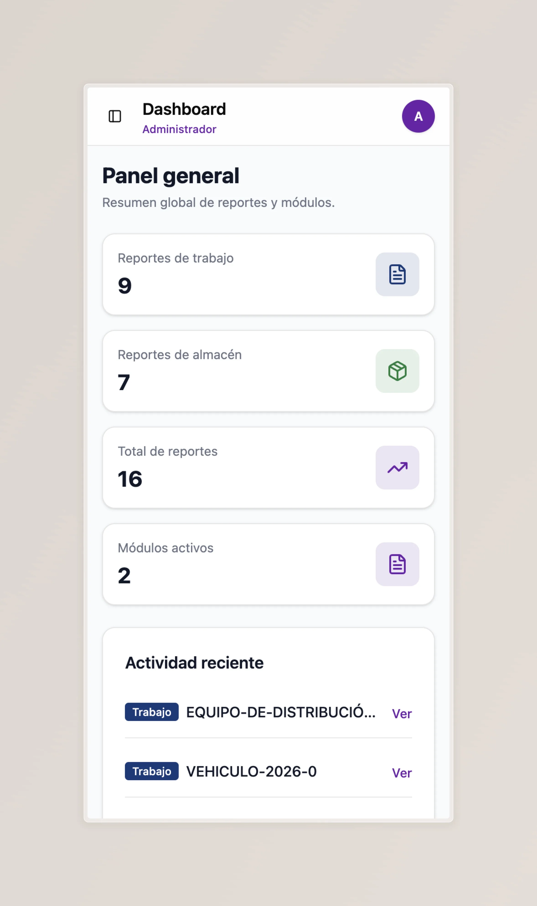
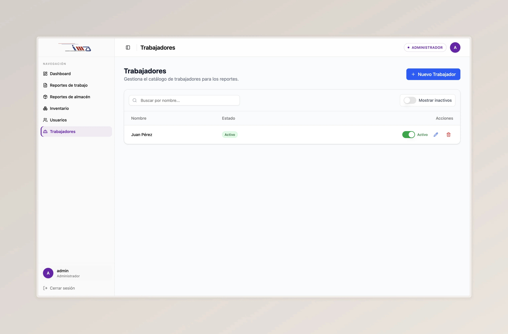

## Una operación técnica que vivía entre archivos sueltos

**IMA Soluciones** es una empresa mexicana con más de 20 años en electrificación ferroviaria, mantenimiento electromecánico e ingeniería para energía y telecomunicaciones. Sus equipos coordinan proyectos técnicos dentro y fuera de México.

La operación real de IMA estaba viva — pero la información que la sostiene vivía en archivos sueltos, mensajes y formatos en papel. Cuellos de botella escondidos a plena vista: cada reporte se capturaba dos veces, cada evidencia se buscaba en el lugar equivocado, y cada nuevo proyecto arrancaba reinventando la operación.

---

## El reto

Documentación crítica viviendo entre carpetas locales, mensajes y formatos en papel.

- Captura repetida de información entre áreas y proyectos.
- Reportes históricos difíciles de encontrar cuando se necesitaban.
- Evidencias dispersas en carpetas locales y mensajería interna.
- Procesos imposibles de escalar al ritmo de la operación.

---

## La solución

No entregamos software y nos fuimos. Diagnosticamos la operación, construimos la herramienta y formamos al equipo — las tres juntas, porque entregar solo el código habría desplazado el problema, no resuelto.

SYNC desarrolló **IMA Cloud**, una plataforma web interna que centraliza reportes, documentación e inventario en un solo lugar — diseñada alrededor de cómo IMA realmente trabaja, no al revés.

- **Captura una sola vez, consulta desde cualquier área.** La información deja de duplicarse entre formatos y herramientas.
- **Evidencias, reportes e inventario en un mismo sistema.** Adiós a "¿en qué carpeta está esto?".
- **Plantillas dinámicas que se adaptan al trabajo real.** Cada tipo de reporte trae su propia estructura sin romper el flujo.

---

## Funcionalidades principales

### Motor dinámico de reportes

En lugar de formatos rígidos, IMA Cloud maneja estructuras flexibles para cada tipo de reporte operativo. Los equipos técnicos capturan información en plantillas digitales adaptadas a la actividad, no a la herramienta.

- Plantillas con campos dinámicos según el reporte.
- Consulta inmediata del historial.
- Organización por categorías y módulos operativos.

### Gestión documental tipo Drive

Un repositorio interno donde las evidencias y documentos operativos dejan de estar regados entre carpetas locales, mensajes y herramientas externas.

- Carga y organización por carpetas.
- Centralización de evidencias por proyecto.
- Consulta rápida desde cualquier área.

### Control de inventario

Inventario conectado a la operación, no como una hoja de cálculo aparte. Materiales, recursos y movimientos quedan registrados junto al resto de la información del proyecto.

- Registro y consulta de existencias.
- Trazabilidad de movimientos.
- Integración con reportes y documentación.

---

## Cómo trabajamos con IMA

### 1. Diagnóstico

Dos semanas dentro de la operación de IMA: dónde se atascaba el trabajo, qué datos vivían en archivos sueltos, qué procesos seguían vivos por costumbre. Salimos con un plan, no con una propuesta comercial.

### 2. Desarrollo

Construimos motor dinámico de reportes, gestión documental e inventario en ciclos cortos. Cada entrega pasó por el equipo de IMA antes de tocar su día a día — lo que no resolvía el problema real, no se quedaba en producción.

### 3. Acompañamiento

Talleres por rol, guías versionadas con el código, y mantenimiento del sistema en producción del lado nuestro. Plan de Acompañamiento mensual incluido.

---

## Impacto

IMA Cloud movió a IMA Soluciones de una operación dispersa en archivos sueltos a una base digital centralizada y trazable. Nada avanzó por inercia: cada módulo se quedó porque el equipo decidió que servía.

- Reportes operativos en un solo sistema, no en archivos dispersos.
- Evidencias y documentos consultables desde cualquier área.
- Captura digital en plantillas dinámicas, sin formatos físicos.
- Información histórica disponible sin depender de quién la guardó.
- Arquitectura modular lista para sumar nuevos procesos sobre la misma base.

### Antes y después

| Antes | Después |
| --- | --- |
| Reportes manuales o dispersos | Reportes digitales centralizados |
| Archivos en distintas ubicaciones | Sistema documental interno |
| Formatos rígidos | Plantillas dinámicas |
| Consulta lenta del histórico | Acceso organizado a reportes y documentos |
| Inventario separado de la operación | Inventario integrado a la plataforma |
| Procesos difíciles de escalar | Base digital modular y escalable |

---

## Por qué importa

IMA Cloud no fue una página web ni un sistema administrativo genérico. Fue una herramienta construida alrededor de la operación real de IMA — y se quedó en producción porque el equipo la opera todos los días, con SYNC del lado del mantenimiento.

Porque entregar solo el software es desplazar el problema. Nosotros existimos para hacer lo opuesto.
